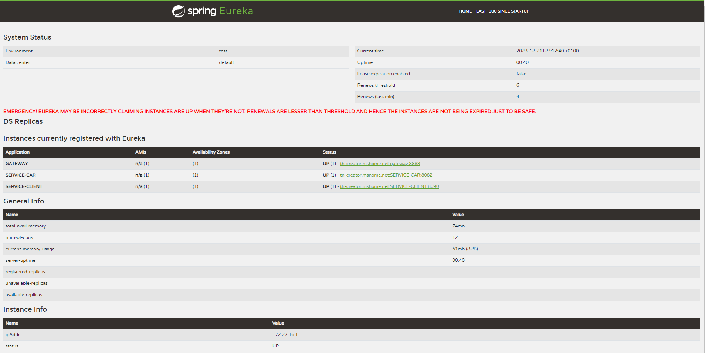

# Microservices Architecture with RestTemplate Mini-Project

This mini-project is designed to create an application based on a microservices architecture for managing clients and cars. Communication between microservices will be facilitated using RestTemplate, and configuration files in the properties format will be replaced with YAML files. In this initial phase, the focus is on setting up the Eureka service discovery.

## Objective

The primary goal of this mini-project is to implement a robust microservices architecture for managing Client and Car entities. RestTemplate will be used for communication between microservices, and configuration files will be migrated to YAML for improved readability and flexibility.

## Steps

### A. Setting up Eureka Service Discovery

1. **Configure Eureka Project**
   - Create a new Spring Boot project for the Eureka Discovery service.
   - Configure the `application.yml` file with necessary properties, such as the listening port and application name.

2. **Eureka Server Annotation**
   - Use the `@EnableEurekaServer` annotation on the main class to indicate that this service will act as the Eureka discovery server.

3. **Configure Microservices Clients**
   - Add the Eureka dependency to the client microservices projects.
   - Configure YAML files to specify the Eureka registry and application name.

4. **RestTemplate Communication**
   - Set up communication between microservices using RestTemplate.
   - Use the application name registered in Eureka to make service calls.

## Execution

1. **Start Eureka Service**
   - Start the Eureka service by running the main class of your Eureka project.

2. **Start Microservices Clients**
   - Launch the microservices clients. They should automatically register with the Eureka service.

3. **Check Service Discovery**
   - Access the Eureka console (`http://localhost:{port}/`) to verify if the microservices are correctly registered.

   

4. **Communication Tests**
   - Perform RestTemplate calls between microservices to ensure communication is functioning correctly.

## Notes

- Ensure appropriate dependencies in the `pom.xml` file for projects, such as `spring-cloud-starter-netflix-eureka-server` and `spring-cloud-starter-netflix-eureka-client`.
- Use the application name registered in Eureka in RestTemplate calls to ensure effective service discovery.

## Conclusion

Setting up the Eureka service discovery in this initial part of the mini-project lays the foundation for a well-structured microservices architecture. The next steps will include implementing specific functionalities for the Client and Car microservices, along with more in-depth testing of the interaction between services.

Please note that the server is configured using YAML (`application.yml`), while the other services use properties files.
